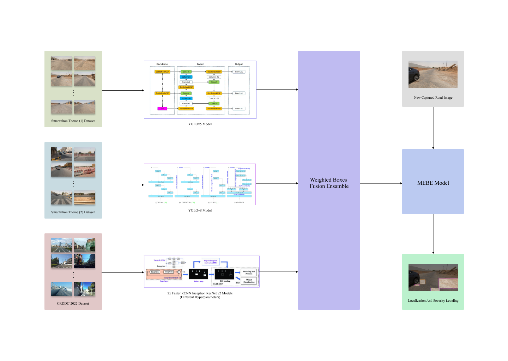
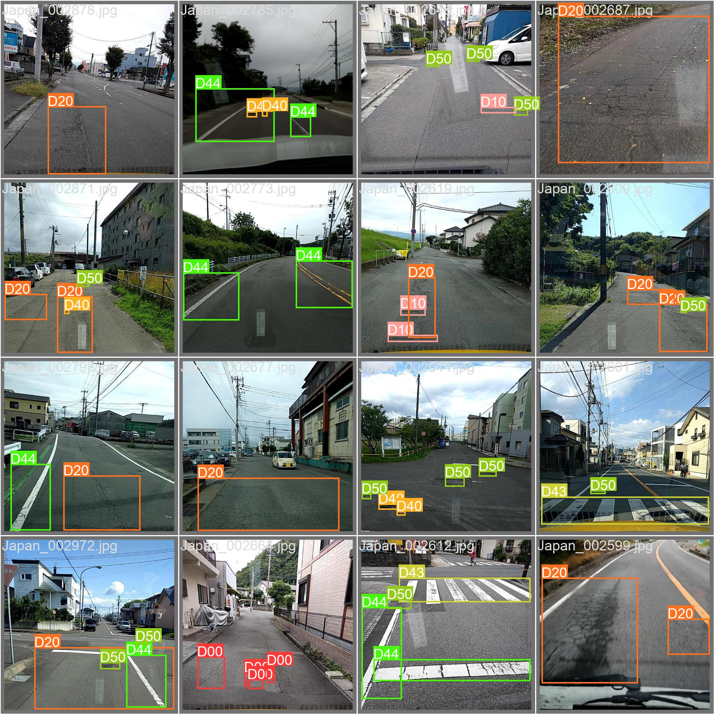
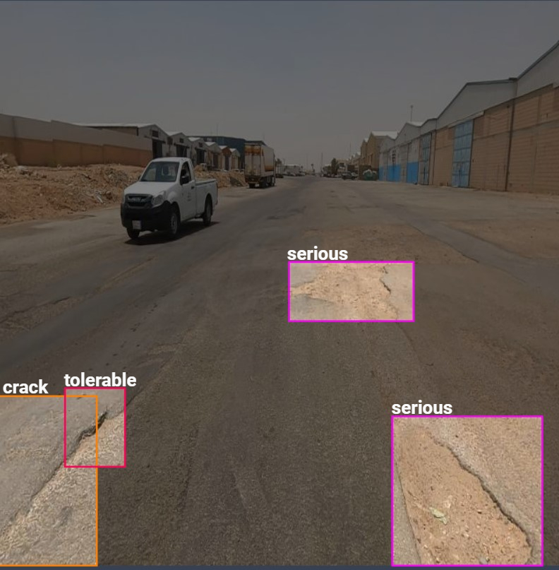
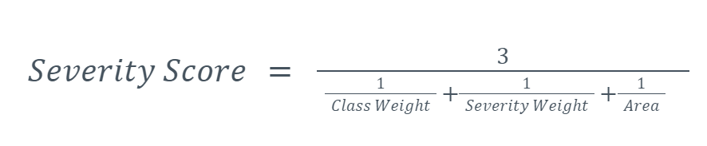
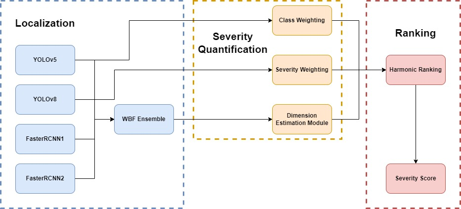

# Mebe: An Ensemble Approach To Classify The Severity of Potholes In Streets Using Deep Learning and Image Processing

## Overview

**Mebe** is an innovative ensemble approach designed to classify the severity of potholes in streets through the integration of deep learning and image processing techniques.

## Localization of Potholes

To effectively localize potholes, we employed a combination of state-of-the-art deep learning models, each specialized in different aspects:

1. **YOLOv8**: Localizes and classifies potholes based on severity.
2. **YOLOv5**: Enhances localization and adds classification capabilities.
3. **Faster RCNN Inception Resnet V2 1024x1024**: Focuses on precise localization.

These models were trained on distinct datasets, ensuring diversity and reducing overfitting:

- Smartathon Theme 2 road potholes dataset (Manually Annotated)
- Smartathon Theme 1 dataset (Multitask learning for better feature understanding)
- CRDDC 2022 dataset

Although each model is trained for a different task (more details further down), all of them work together to localize and estimate the magnitude of the potholes. After each model proposes the potential bounding boxes of the potholes in a certain image (video frame), the final output is obtained from a weighted boxes fusion ensemble between the 4 models. Higher weights were given to models that were trained on Theme 2 dataset.

## Estimation of Pothole Magnitude

The proposed system includes a module for estimating the dimensions of detected potholes using image processing (Dimension Estimation Module). This module applies the triangle similarity property, where an object of a specific width is photographed from a specific distance to obtain the apparent width in pixels, and because the camera is mounted at a constant elevation from the street, we can calculate the perceived focal length using the formula:

To find the focal length, and since the data has multiple frame images that are captured from different distances as the car is moving, we obtain an object with a known length and put it in the street, the edges of the object are detected by applying a Canny edge detector algorithm to get the pixel length of the object. The perceived focal lengths are calculated using the formula above for each of the images with their respective parameters. The average of these focal lengths gives the final perceived focal length.
Since we know the final perceived focal length, width, length, and area of each pothole can be calculated using the formula above, and this makes a great estimator of the severity of the detected potholes in no time, minimizing the costs, and maximizing performance.

## Potential Applications

### 1. Accurate Pothole Detection

As mentioned above, we trained four models on different datasets, we achieved acceptable accuracies on each of these datasets. But after ensembling, the pipeline shows potential in detecting potholes very accurately. As well as classifying them and determining their severity. Review the provided learning curves images for specific numbers.

### 2. Precise Magnitude Estimation

The proposed system hardly ever misses a pothole because of the variety of models as well as the variety of data sources. Our system not only detects the magnitude of the potholes but also classifies them into (Pothole, Separation, Crack, Partial Pavement, Overall Pavement, Equal Interval, Wheel Mark, Rutting, and Bump). And then classifies them again as (Serious, Tolerable, and Insignificant). And then it calculates their areas. All these are finally used to determine their severity as described in the next paragraph.

### 3. Identification of Urgent Potholes

To determine the severity of a given pothole, an image goes through 3 steps: - The YOLOv5 model classifies each pothole as one of the mentioned classes. A class weight is assigned to each pothole according to its class (ex. Pothole, Separation, Crack, etc). The weights are determined by domain experts. - The YOLOv8 model classifies each pothole/ damage as (Serious, Tolerable, and Insignificant). And assign this label as severity weight for each pothole. - The Dimension Estimation Module estimates the area of each pothole.
Then the final severity score (urgency score) is calculated according to the following formula:
Severity Score = 3 / ((1 / Class Weight) + (1 / Severity Weight) + (1 / Area))
This equation represents a ranking algorithm through employing a harmonic mean for each pothole predicted label (which have been encoding numerically) and the calculated estimation of its magnitude, as well as the assigned class for that pothole, making the most urgent/problematic potholes appear on top of the list.

## Lidar Comparison

Computer vision technology can improve pothole detection using deep learning algorithms that identify potholes based on shape, size, and location. Incorporating multiple camera data and 3D reconstruction can also enhance accuracy. However, lidar has advantages such as working in low light and adverse weather conditions. To overcome this, our model is trained on diverse weather conditions and different levels of illumination. Additionally, a long range of vision is not a priority as the model quickly interacts with the road frame by frame.

## Solution Autonomy and Scalability

The only human intervention would be to set a camera (which can be a smartphone camera) at an appropriate position in which a full view of the road can be seen and calibrate it to calculate the focal length as described above. Analysis can be given through an intelligent interface (e.g. a mobile application for the beneficiary) so that any insights and notifications regarding the nature of detected potholes could be accessed easily. Since the solution is easy to implement, cheap, user-friendly, and very fast to infer from, we believe that it has everything to scale. Moreover, we’re using computationally light models to detect the potholes such as YOLOv5 and YOLOv8 so we believe that our system can be configured to work in real time with reasonable computational resources and this is a huge scaling advantage in the real world.

